## Дипломный практикум в Yandex Cloud

[Дипломный практикум в Yandex.Cloud](https://github.com/netology-code/devops-diplom-yandexcloud)

---
### Студент: Казначеев Илья
---

[Репозиторий проекта](https://github.com/IlyaBridge/cloud-platform-foundation)

### Цель работы
- подготовка облачной инфраструктуры в Yandex Cloud;
- развёртывание и настройка Kubernetes кластера;
- установка системы мониторинга (Prometheus, Grafana, Alertmanager);
- контейнеризация тестового приложения с помощью Docker;
- настройка CI/CD для автоматической сборки и деплоя приложения;
- автоматизация управления инфраструктурой с помощью Terraform и Atlantis.

## Дипломный практикум в Yandex Cloud

---

## Используемые технологии

- **Yandex Cloud** — облачная платформа
- **Terraform** — управление инфраструктурой
- **Managed Kubernetes** — контейнерная оркестрация
- **Docker** — контейнеризация приложения
- **Yandex Container Registry** — хранение Docker-образов
- **Prometheus + Grafana** — мониторинг
- **Atlantis** — Terraform pipeline
- **GitHub Actions** — CI/CD

---

## Этапы выполнения

### 1. Создание облачной инфраструктуры
Инфраструктура создана с помощью Terraform.  
Terraform state хранится в Object Storage.

### 2. Создание Kubernetes кластера
В проекте использован Yandex Managed Service for Kubernetes с региональным мастером.  
Доступ к кластеру осуществляется через kubeconfig.

### 3. Создание тестового приложения
Подготовлено простое приложение на базе Nginx, отдающее статическую HTML-страницу.  
Образ собирается через Dockerfile.

### 4. Мониторинг и деплой приложения
В кластер установлены Prometheus, Grafana и Alertmanager.  
Grafana доступна по HTTP и отображает состояние Kubernetes-кластера.

### 5. CI/CD
Настроен GitHub Actions pipeline:
- сборка Docker-образа
- push в Yandex Container Registry
- деплой в Kubernetes

### 6. Terraform pipeline
Для управления инфраструктурой используется Atlantis, автоматически применяющий изменения через Pull Request.

---

## Структура репозитория

```
cloud-platform-foundation/
.
├── .github/
│   └── workflows/
│       └── app-cicd.yml         # GitHub Actions: build & deploy приложения
│
├── app/                         # Тестовое приложение (nginx)
│   ├── Dockerfile               # Dockerfile для сборки Docker-образа приложения
│   ├── index.html               # Статическая HTML-страница, отдаваемая nginx
│   ├── nginx.conf               # Конфигурация nginx
│   └── README.md                # Описание тестового приложения
│
├── kubernetes-manifests/        # Kubernetes манифесты
│   ├── application/             # Манифесты тестового приложения
│   │   ├── deployment.yaml      # Deployment приложения
│   │   ├── ingress.yaml         # Ingress для внешнего HTTP-доступа
│   │   └── service.yaml         # Service для доступа внутри кластера
│   │
│   ├── atlantis/                # Atlantis для Terraform CI/CD
│   │   ├── backend.conf         # Backend конфигурация Terraform
│   │   ├── ingress.yaml         # Ingress для Atlantis
│   │   └── values.yaml          # Helm values для Atlantis
│   │
│   ├── ingress/                 # Ingress Controller (nginx)
│   │   ├── ingress-service.yaml
│   │   ├── namespace.yaml
│   │   └── nginx-ingress.yaml
│   │
│   └── monitoring/              # Мониторинг Kubernetes
│       ├── grafana-ingress.yaml # Ingress для Grafana
│       ├── prometheus-ingress.yaml # Ingress для Prometheus
│       └── values.yaml          # Helm values для kube-prometheus-stack
│
├── scripts/                     # Вспомогательные скрипты
│   ├── configure-atlantis-runtime.sh # Runtime-настройка Atlantis
│   ├── deploy.sh                # Деплой Kubernetes ресурсов
│   ├── destroy.sh               # Удаление инфраструктуры
│   └── setup-k8s-access.sh      # Настройка доступа к Kubernetes
│
├── terraform/                   # Infrastructure as Code (Terraform)
│   ├── infrastructure/          # Базовая облачная инфраструктура (VPC, сети, подсети)
│   ├── kubernetes/              # Yandex Managed Kubernetes кластер и node group
│   └── registry/                # Yandex Container Registry
│
├── .gitignore                   # Исключение секретов и временных файлов
├── atlantis.yaml                # Конфигурация Atlantis (projects/workflows)
└── README.md                    # Основное описание дипломного проекта
```

---

## Этап 1. Создание облачной инфраструктуры

---

### Описание
Инфраструктура в Yandex Cloud создаётся полностью с помощью Terraform.
Используется Object Storage в качестве backend для хранения state.

Созданы:
- VPC и подсети в разных зонах доступности;
- сервисные аккаунты с минимально необходимыми правами;
- Yandex Managed Kubernetes;
- Yandex Container Registry.

### Скриншоты для отчёта:

1. Yandex Cloud Console -> созданные ресурсы

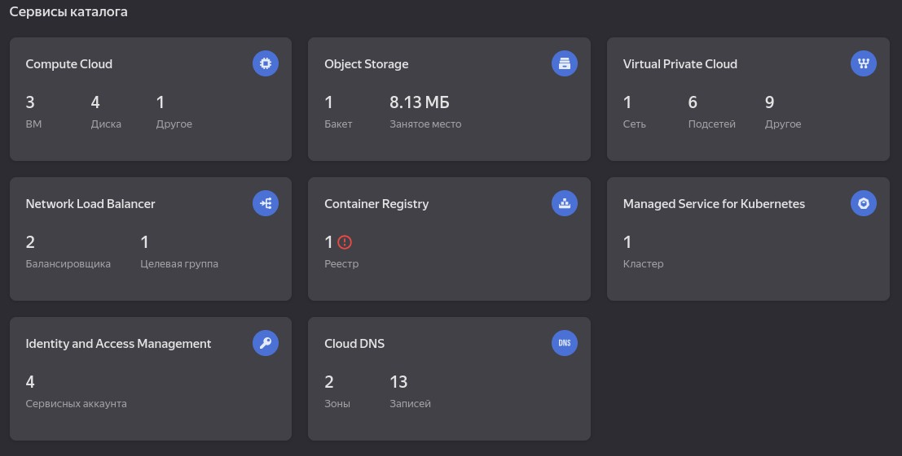

В Yandex Cloud Console отображаются созданные ресурсы, Managed Kubernetes, VPC, Object Storage, Container Registry.
Данные компоненты инфраструктуры были созданы автоматически средствами Terraform.

2. Object Storage bucket (backend)

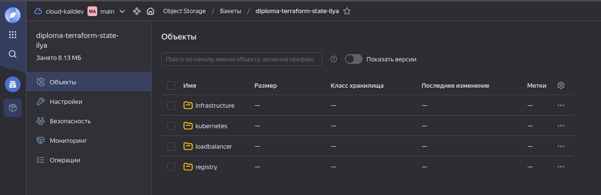

Для хранения Terraform state используется Object Storage в Yandex Cloud.
State-файлы разделены по компонентам инфраструктуры (infrastructure, kubernetes, registry).

### Итог:
- инфраструктура разворачивается автоматически;
- Terraform state хранится в Object Storage;
- нет ручных операций после `terraform apply`.

---

## Этап 2. Создание Kubernetes кластера

---

### Описание
Использован Yandex Managed Service for Kubernetes:
- региональный control plane;
- worker-ноды в разных подсетях;
- доступ из интернета.

Kubeconfig получен и настроен локально.

### Проверка
```bash
kubectl get nodes
kubectl get pods --all-namespaces
```

### Скриншоты:

1. `kubectl get nodes`

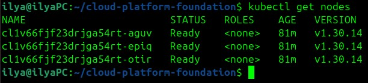

2. `kubectl config current-context`

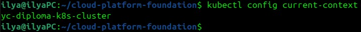

3. `kubectl get pods --all-namespaces`

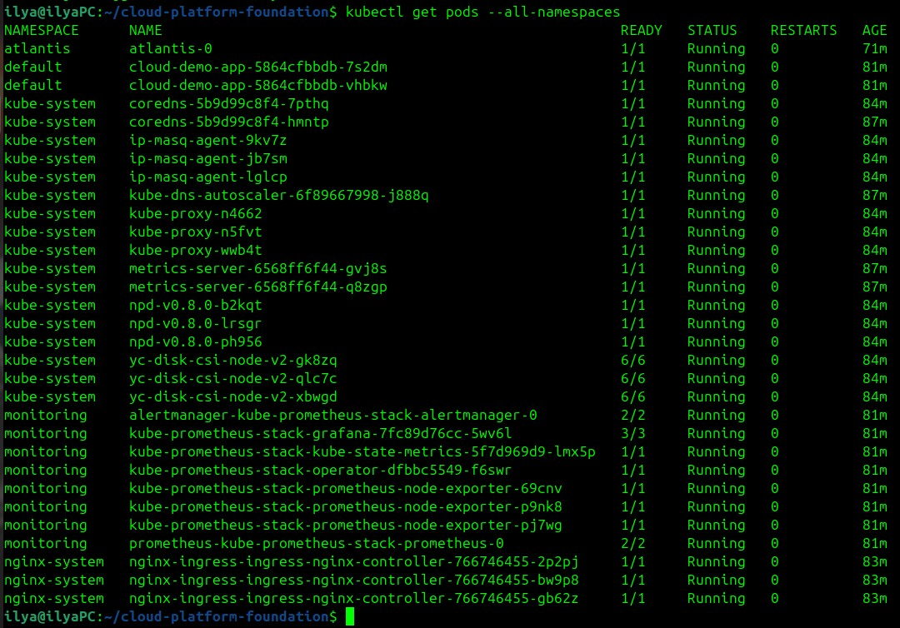

4. `kubectl cluster-info`

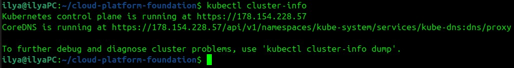

---

## Этап 3. Создание тестового приложения

---

### Описание
Создано простое тестовое приложение:
- nginx;
- отдаёт статическую HTML страницу;
- упаковано в Docker-контейнер.

### Dockerfile
Используется образ `nginx:alpine`.

### Результат
- Docker image собирается;
- image хранится в Yandex Container Registry.

### Скриншоты:
1. Deployment и Pods приложения.
```bash
kubectl get deploy -n default
kubectl get pods -n default -o wide
```

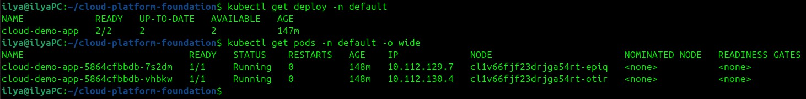

Тестовое приложение успешно развернуто в Kubernetes в виде Deployment.
Pod’ы находятся в состоянии Running.

2. Service и Ingress приложения.
```bash
kubectl get svc -n default
kubectl describe ingress cloud-demo-app -n default
```

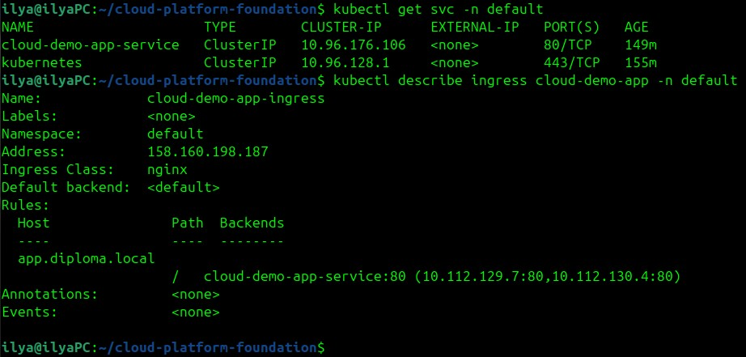

Для тестового приложения настроены Kubernetes Service и Ingress.
Ingress обеспечивает внешний HTTP-доступ к приложению по 80 порту.

3. Приложение 
`http://app.diploma.local/`

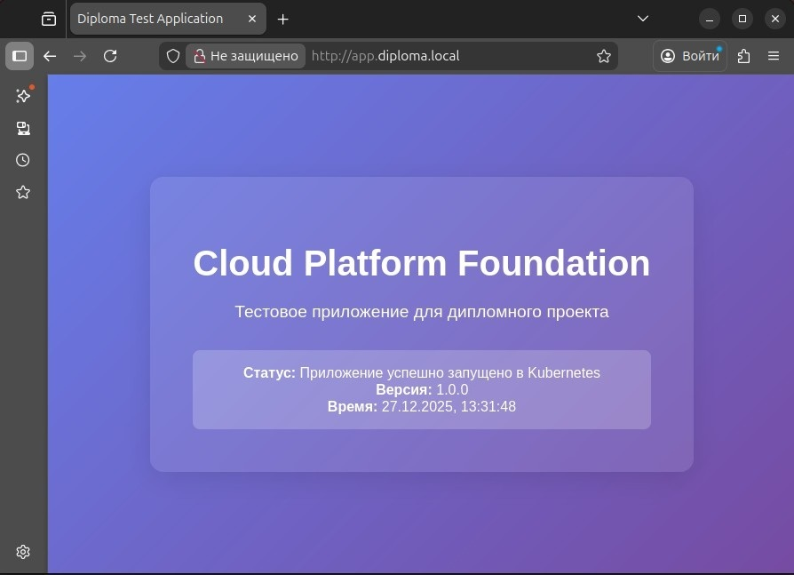

Тестовое приложение доступно по HTTP через Ingress-контроллер.
Приложение корректно отвечает на запросы и отдаёт статическую HTML-страницу.

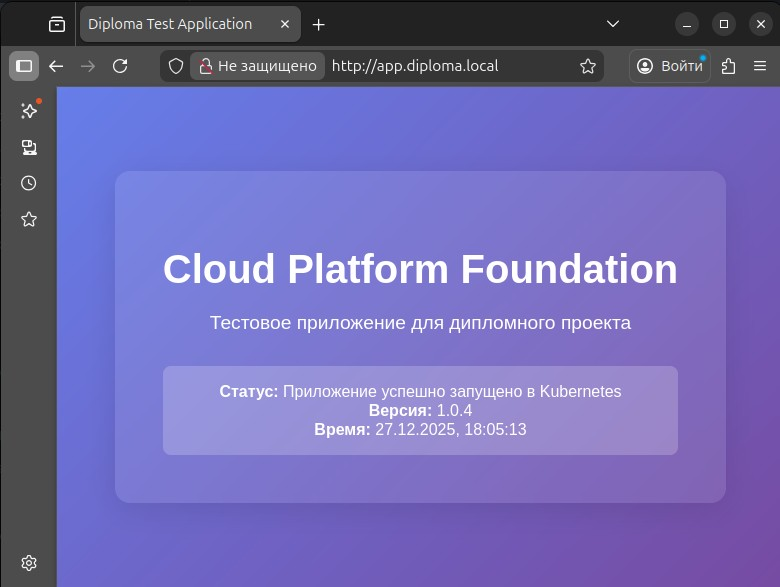

Данный скриншот демонстрирует обновление тестового приложения через CI/CD, уже после (см. далее).

---

## Этап 4. Мониторинг и деплой приложения

---

На данном этапе в Kubernetes-кластер была развернута система мониторинга и тестовое приложение.

### Мониторинг
Установлен kube-prometheus-stack, включающий:
- Prometheus
- Grafana
- Alertmanager
- node-exporter

Использован Helm.

### Доступ
- Grafana доступна по HTTP (Ingress);
- настроены Kubernetes dashboards.

### Скриншоты:

1. Состояние мониторинга в кластере.
```bash
kubectl get pods -n monitoring
```

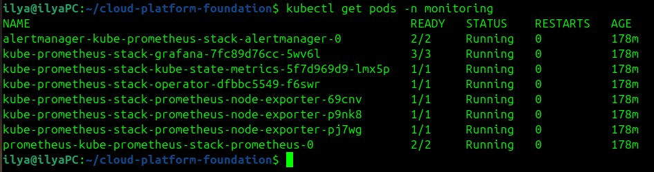

В namespace monitoring успешно запущены pod’ы Prometheus, Grafana, Alertmanager и node-exporter.

2. Сервисы мониторинга.
```bash
kubectl get svc -n monitoring
```

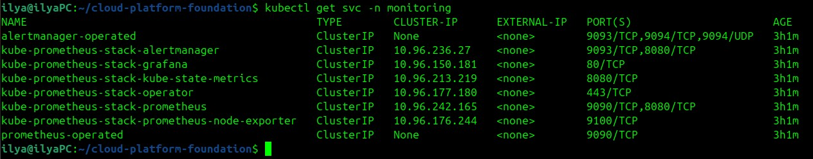

Сервисы Prometheus, Grafana и Alertmanager созданы и доступны внутри кластера.

3. Проверка Ingress для мониторинга.
```bash
kubectl get ingress -n monitoring
```

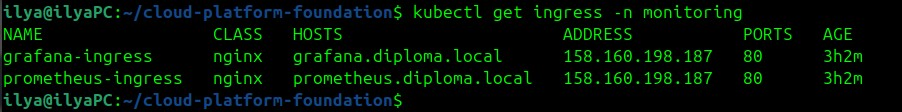

Настроен Ingress для доступа к Grafana и Prometheus по HTTP.

4. Доступ к Grafana. Проверка Ingress Grafana.
```bash
kubectl describe ingress grafana -n monitoring
```

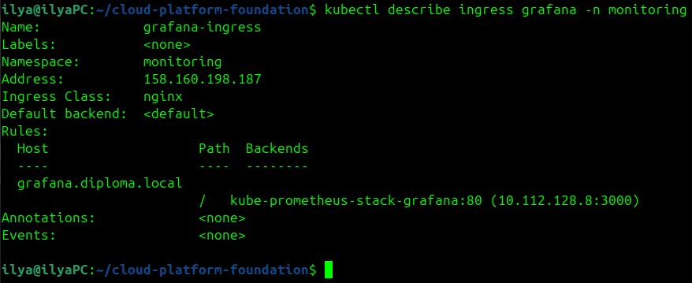

Grafana доступна извне через Ingress и слушает HTTP-порт 80.

5. Grafana UI
http://grafana.diploma.local/login


Веб-интерфейс Grafana, выбор метрик.

---

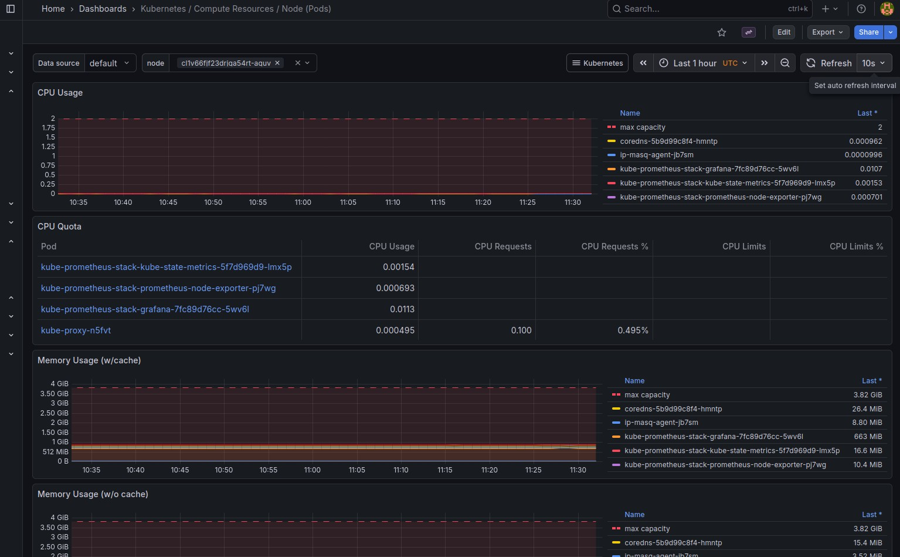

Kubernetes / Compute Resources / Node (Pods) — метрики по состоянию pod'ов на уровне нод.

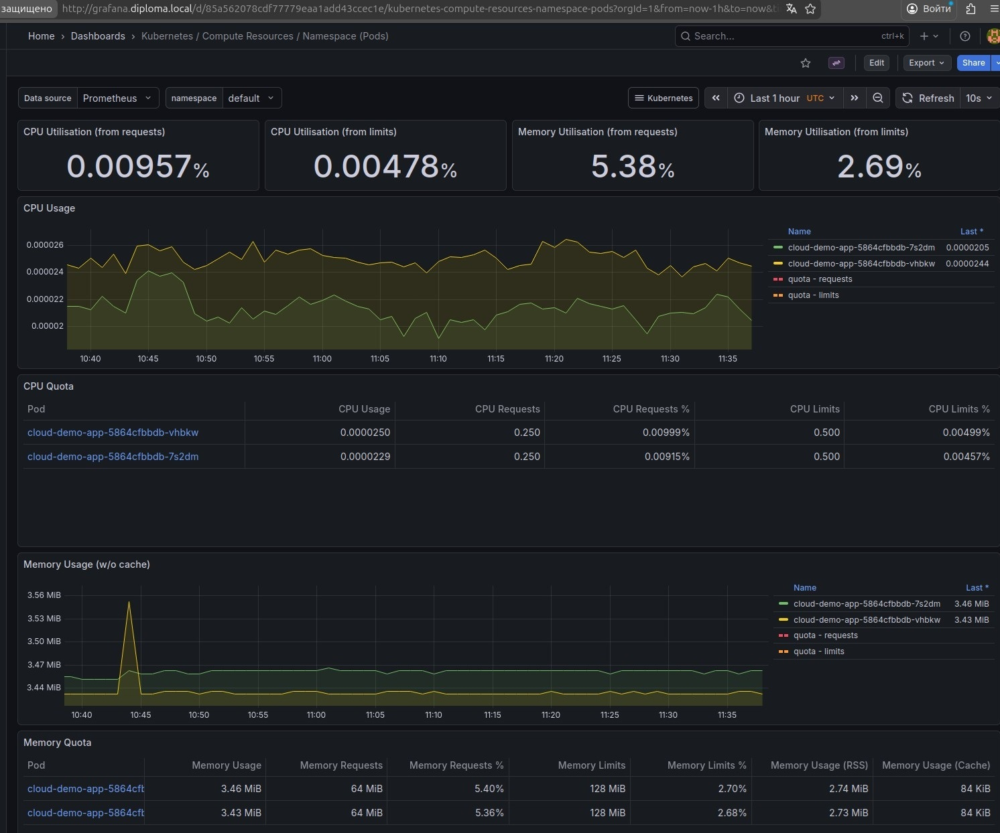

Kubernetes / Compute Resources / Namespace (Pods) — метрики по pod'ам в определённых неймспейсах.

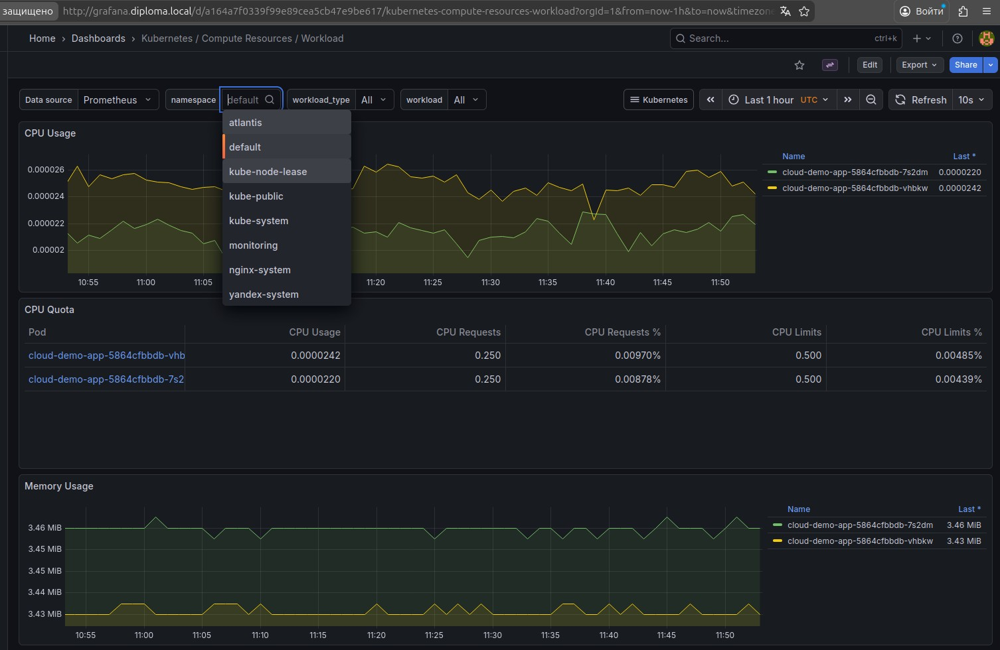

Kubernetes / Compute Resources / Workload — метрики по рабочим нагрузкам в кластере.

---

6. `kubectl get svc -A`

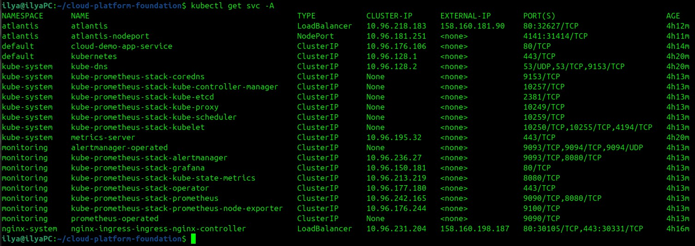

7. `kubectl get ingress -A`

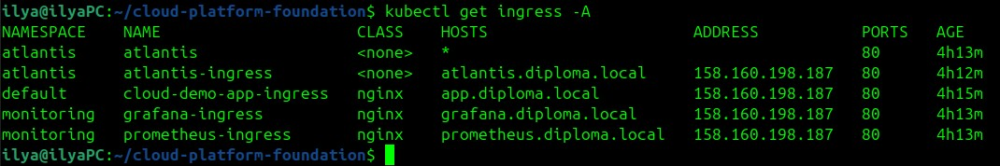

---

## Этап 5. Terraform pipeline (Atlantis)

---

Atlantis - инструмент для автоматического запуска Terraform планов и применения изменений на основе Pull Request'ов (PR). 
Здесь Atlantis автоматически выполняет команду terraform plan и, после одобрения, применяет изменения с помощью команды atlantis apply.
Т.е. в Kubernetes установлен **Atlantis**, который:
- реагирует на Pull Request;
- выполняет `terraform plan`;
- применяет изменения после `atlantis apply`.

### Скриншоты результатов:
Pull Request с комментарием Atlantis (plan)
Pull Request с `Apply complete`
UI Atlantis (jobs)

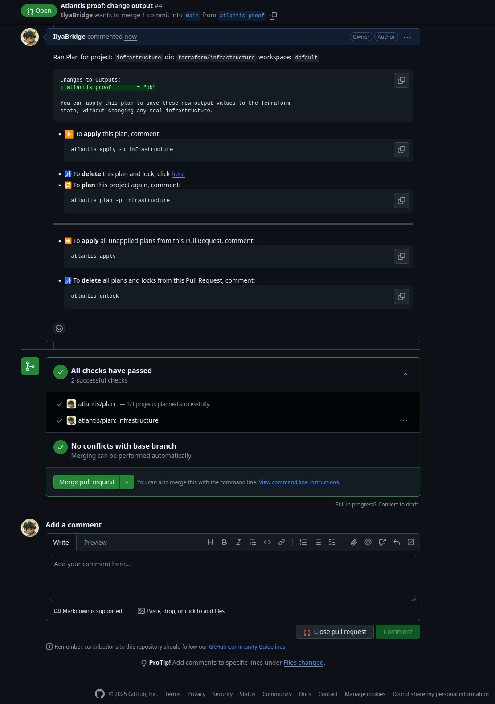

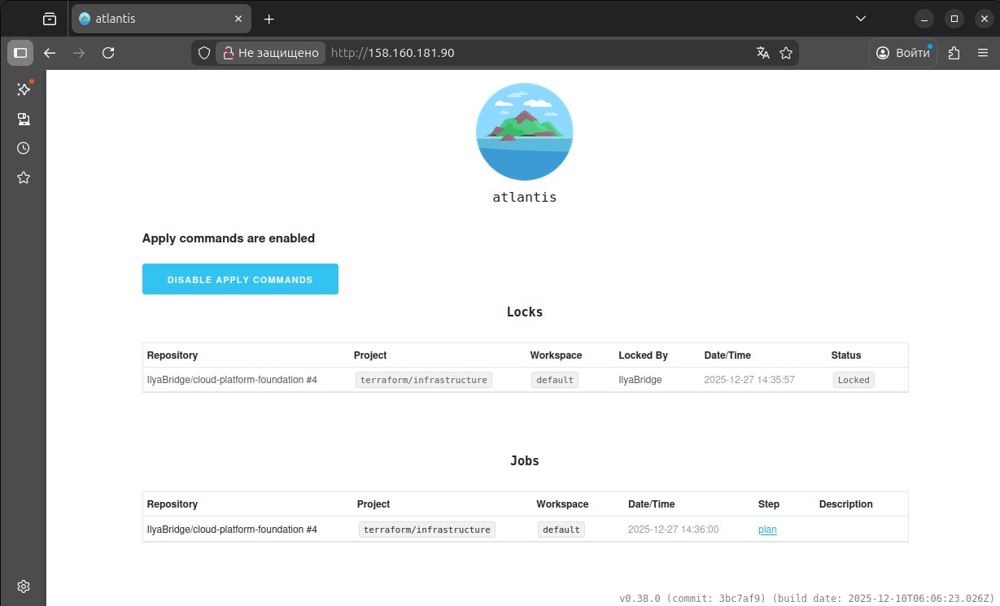

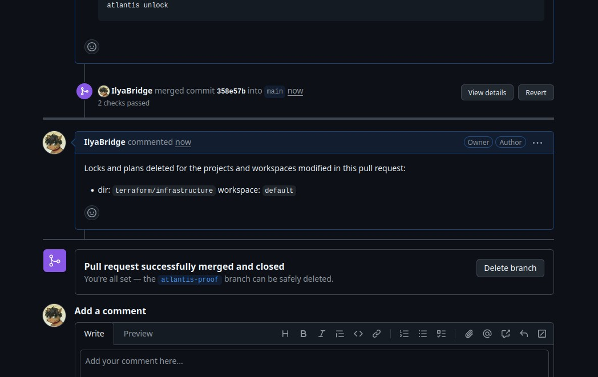

---

## Этап 6. CI/CD для приложения (GitHub Actions)

---

### Описание

Настроен GitHub Actions workflow:
* при `push` в `main`:
  - сборка Docker image;
  - push в Yandex Container Registry;
  - rolling update в Kubernetes;
* при создании тега `v*`:
  - image с версионным tag;
  - деплой соответствующей версии.

### Workflow
Файл:
`.github/workflows/app-cicd.yml`

### Скриншоты:
1. GitHub -> Actions -> Run

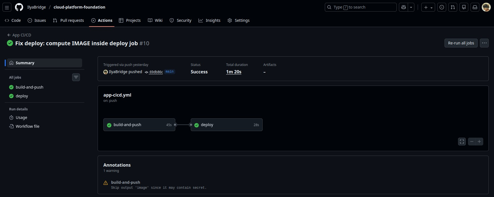

Вывод из вкладки GitHub -> Actions -> Run (для визуализации начала выполнения и состояния процесса).

2. Build & Push image

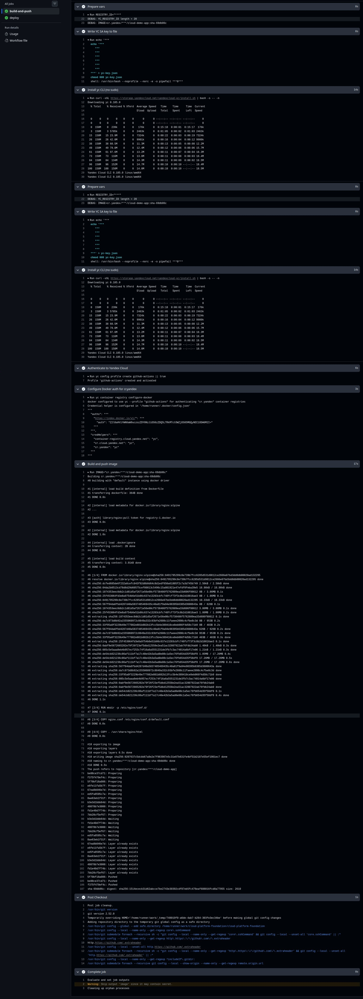

Образ был успешно построен и отправлен в реестр.

3. Deploy step (successfully rolled out)

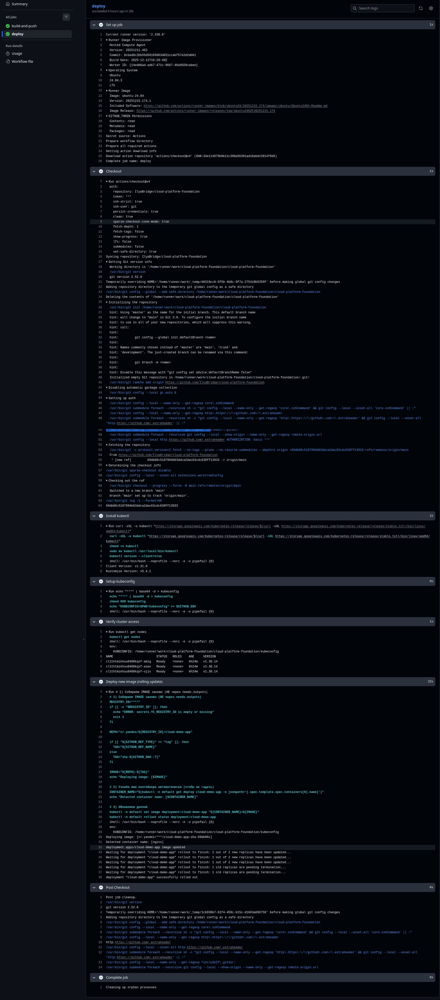

Успешный деплой в Kubernetes (с сообщением "successfully rolled out").

4. `kubectl get deploy cloud-demo-app`

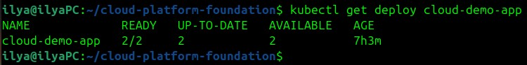

Команда `kubectl get deploy cloud-demo-app` подтверждает успешный деплой и актуальную версию приложения в кластере.

---

## Финальный результат

В рамках дипломного проекта реализовано:

1. Автоматическое создание инфраструктуры
2. Рабочий Kubernetes кластер
3. Мониторинг (Prometheus + Grafana)
4. Тестовое приложение, доступное по HTTP
5. Terraform pipeline через Atlantis
6. CI/CD pipeline через GitHub Actions

---

## Запуск 
1. Файл развёртывания инфраструктуры - deploy.sh
Команда на выполнение:
```bash
cd /home/ilya/cloud-platform-foundation/scripts
./deploy.sh
```

2. Настройка Webhooks, раздел IP на GitHub в Settings -> Webhooks -> Settings -> Payload URL * Пример: `http://158.160.217.161/events`

3. Файл конфигурации Atlantis - configure-atlantis-runtime.sh
Команда на выполнение:
```bash
cd /home/ilya/cloud-platform-foundation/scripts
./configure-atlantis-runtime.sh
```

4. Настройка CI/CD

## Ссылки
- Файл [deploy.sh](https://github.com/IlyaBridge/cloud-platform-foundation/blob/main/scripts/deploy.sh)
- Файл [configure-atlantis-runtime.sh](https://github.com/IlyaBridge/cloud-platform-foundation/blob/main/scripts/configure-atlantis-runtime.sh)
- Репозиторий: `https://github.com/IlyaBridge/cloud-platform-foundation`
- Тестовое приложение: `http://`
- Grafana: `http://`

---
